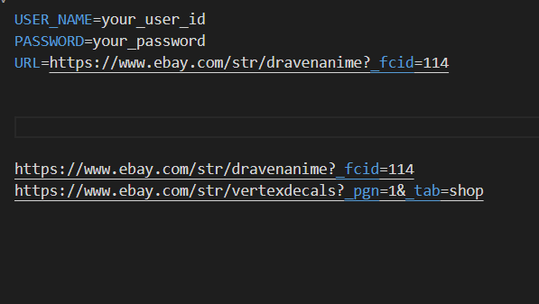

# Setup Instructions

This document provides instructions to set up the Python environment for this project, install necessary dependencies, and run the application.


This will create a virtual environment named `venv`.

## 1. Activate the Virtual Environment

- On Windows Command Prompt:

```cmd
venv\Scripts\activate.bat
```

- On Windows PowerShell:

```powershell
venv\Scripts\Activate.ps1
```

## 2. ChromeDriver Setup

This project uses Selenium with Chrome WebDriver. Please ensure:

- Google Chrome browser is installed on your system.
- ChromeDriver executable is installed and its version matches your Chrome browser version.
- ChromeDriver is added to your system PATH, or placed in the project directory.

You can download ChromeDriver from: https://sites.google.com/chromium.org/driver/

## 3. Environment Variables

Here a `.env` file in the project root directory with the following content:

```
USER_NAME=your_ebay_username
PASSWORD=your_ebay_password
URL= your_ebay_url
```

Replace `your_ebay_username` and `your_ebay_password` with your actual eBay login credentials.

## 4. Run the Application

With the virtual environment activated, run the main script:

```bash
python main.py
```

This will start the automation script.

---
## for second's url  user go into .env file and  copy the url and paste in front of URL in same file.


----
If you encounter any issues, please ensure all dependencies are installed correctly and ChromeDriver is properly set up.
